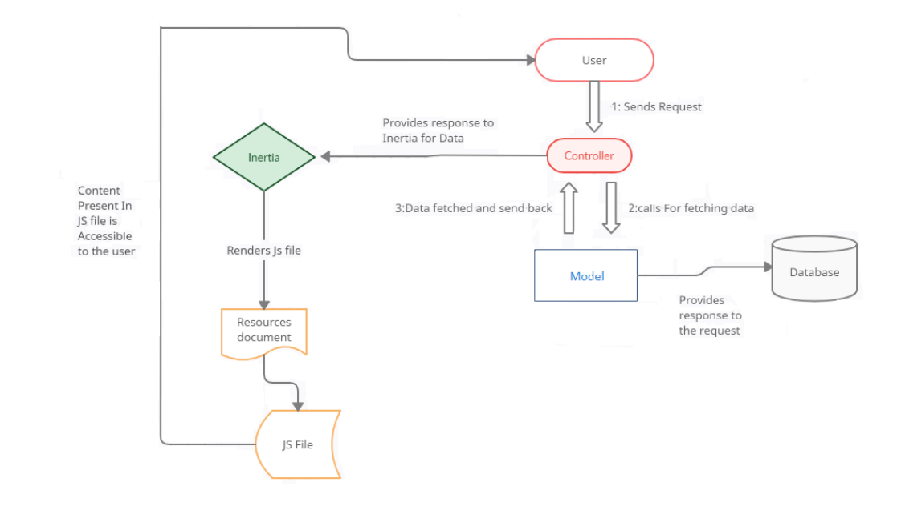
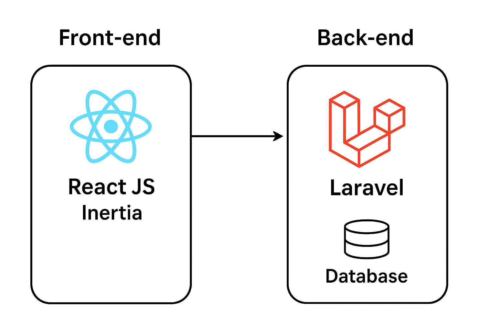

# Documentation du projet (CRUD application d'hôtel)
**Laravel 12 - PHP 8.2 -MySQL 8.0 - Inertia React Js**


---

## Technologies utilisées
- **Laravel 12**
- **PHP 8.2**
- **MySQL 8.0**
- **Inertia js**
- **React Js**
- **Chackra UI**
- **Docker**

---


## Description
Ce projet consiste à la réalisation d'une mini application de gestion
d'hotel avec la mise en place de CRUD sur la gestion des informations d'un hôtel et sa conteneurisation grâce à
docker.
---
## Architecture
**Fonctionnement de Laravel avec React Js intégré via Inertia**


**Architecture logicielle de l'application**

---
## Lancement du projet
### Pré-requis
Installer composer, une version de php >=8.0 et node js version >=20

### Installation et lancement en local
- Après avoir clooner le projet, aller à la racine de votre projet et lancer les commandes suivantes:
- Avoir également une base de données MySQL fonctionnel à configurer en fonction des informations disponible dans le fichier 
.env.example en faire une copie et remplir convenablement avec les informations de connexion de votre base de données.
- S'assurer que les ports 8000 et 5173 soient disponibles.

```bash
npm install  #Installation des dépendances côté front
composer install #Installation des dépendances côté backend
php artisan migrate --seed  #Migration + données de tes pour populer votre base de données

```
Ensuite pour lancer l'application vous avez deux options:
### Option 1 - Une seule commande 
```bash
composer run dev
```

### Option 2 - Séparé: dans deux terminales
```bash
php artisan serve 
```
et dans un autre terminal 
```bash
npm run dev
```
C'est fait !! si tout ce passe bien votre application sera disponible sur: http://localhost:8000/hotels

## Installation via Docker 
Pour obtenir l'application sous forme de conteneur prêt à l'emploi, 
il faut suivre les étapes préalables et faire à la racine du projet clooner:
```bash
docker compose up -d --build  #builder et démarrer l'application en mode détaché
ou en deux commandes
docker compose build app  et après, docker compose up -d

 docker compose logs -f app #pour suivre les logs du service de l'application
#et s'assurer qu'elle a complètement démarré avant de s'y connecter
```

---
##  Backend (Laravel)

### Routes
- Fichier : **routes/web.php**
- Contient tous les endpoints (Inertia + API interne)

### Controllers
- **Controllers Pages**
    - Gèrent l’affichage des pages React via Inertia
- **Controllers de gestion**
    - CRUD Hotels
    - Gestion des images d’hôtels

### Requests
- Validation des champs pour les formulaires (Store / Update)

### Models
- `Hotel`
- `HotelPicture`

### Factories
- `HotelFactory`
- `HotelPictureFactory`
### Seeder
- `databaseSeeder`
### ORM
- Utilisation d’Eloquent pour les requêtes SQL

### Base de données MySQL
Tables :
- `hotels`
- `hotel_pictures`

---

## Frontend (React + Inertia + Chakra UI)

### Pages
- **hotels/**
    - Pages liées aux hôtels (index, show, create, update)
- **pictures/**
    - Gestion des images d’hôtels
- **utils/**
    - Fonctions utilitaires
- **components/**
    - Composants réutilisables (formulaires, UI)

### Communication Backend
- Requêtes axios :
    - `GET`
    - `POST`
    - `PATCH`
    - `DELETE`
    - etc.


### Améliorations
- Ajouter un sytème d'authentification basé sur des rôles utilisateurs pour s'assurer qu'un utilisateur
n'ayant pas créer un hôtel puisse le modifié ou le supprimé.

- Ajouter des tests sur les interfaces React JS pour s'assurer des boutons, liens ou tableau attendu.

- Gérer l'enrégistrement des fichiers grâce à un jobs pour rendre l'application plus fluide et réduire l'attente de la création du fichier et son
enrégistrement en base de données.
- Le UI (User Interface) peut être améliorer considérablement avec la mise en place d'une bonne maquette 
- 
